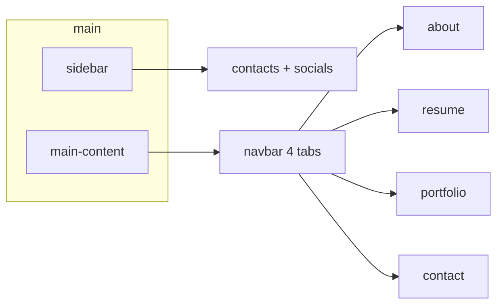

# Intégration du template graphique vCard (sans changer la stack)

## Contexte

- **Exemple** : [vcard-personal-portfolio](file:///d:/source/repos/samples/vcard-personal-portfolio) — layout `main` > `aside.sidebar` + `div.main-content`, navbar à boutons (`[data-nav-link]`), pages en `article[data-page]`, [assets/css/style.css](file:///d:/source/repos/samples/vcard-personal-portfolio/assets/css/style.css), [assets/js/script.js](file:///d:/source/repos/samples/vcard-personal-portfolio/assets/js/script.js), Poppins + Ion Icons.
- **Projet actuel** : [index.html](D:/source/repos/pocs/personal-portfolio-web/index.html), [src/main.js](D:/source/repos/pocs/personal-portfolio-web/src/main.js), [src/data/en.json](D:/source/repos/pocs/personal-portfolio-web/src/data/en.json) / [fr.json](D:/source/repos/pocs/personal-portfolio-web/src/data/fr.json), Pico + [src/styles/main.css](D:/source/repos/pocs/personal-portfolio-web/src/styles/main.css).

**Licence** : le template d’exemple est MIT ; conserver la mention d’attribution (README ou en-tête CSS) comme dans le repo source.

## Décisions de conception

1. **Retirer Pico CSS** pour ce chantier : le vCard impose son reset, ses variables et ses composants ; garder Pico provoquerait des surcharges fragiles. La stack reste **Vite + vanilla JS + modules** ; le style vient du CSS du template.
2. **Ne pas copier le `script.js` du template tel quel** : il gère témoignages (modal), filtre portfolio, formulaire contact, et la navigation par pages contient un **bug d’index** (variable `i` masquée dans la boucle interne — `navigationLinks[i]` incorrect). Réécrire dans [src/main.js](D:/source/repos/pocs/personal-portfolio-web/src/main.js) uniquement : **toggle sidebar mobile**, **navigation par `data-page`** (ex. `data-nav-link` + `data-page` alignés, sans dépendre du texte du bouton).
3. **Contenu** : conserver la source de vérité **en.json / fr.json** + i18n existant ; adapter le rendu aux nouveaux sélecteurs DOM.

## Étapes d’implémentation

### 1. Assets statiques

- Copier depuis l’exemple vers **`public/vcard/`** (ou `public/assets/` pour coller aux chemins du template) : au minimum `icon-design.svg`, `icon-dev.svg`, `icon-app.svg`, `icon-photo.svg` (ou sous-ensemble si vous simplifiez la section « services »), `logo.svg` / favicon si présents, et une **photo avatar** (placeholder du template renommée ou remplacée plus tard).
- Référencer ces fichiers avec des URLs absolues du site : `/vcard/...` pour que `npm run build` et GitHub Pages fonctionnent sans importer les binaires dans le bundle JS.

### 2. Feuilles de style

- Copier [style.css](file:///d:/source/repos/samples/vcard-personal-portfolio/assets/css/style.css) vers **`src/styles/vcard.css`** (fichier volumineux, inchangé sauf si conflit).
- **`src/styles/main.css`** : réduire à des **surcouches minimales** (ex. position du sélecteur de langue, correctifs d’accessibilité) plutôt que dupliquer le thème.
- Dans **`src/main.js`** : `import './styles/vcard.css';` et `import './styles/main.css';` pour que Vite les inclue dans le build (et retirer le lien Pico de `index.html`).

### 3. Nouveau squelette `index.html`

- Remplacer la structure actuelle par le **squelette vCard** :
  - `aside.sidebar` : avatar, nom (`hero.title`), titre (`hero.subtitle` ou champ dédié), bouton « Show contacts », liste contacts (email optionnel depuis JSON, **localisation** depuis `about.location`), **réseaux** générés à partir de `contact.links` (LinkedIn / GitHub avec Ion Icons comme le template).
  - `div.main-content` > `nav.navbar` : **4 onglets** alignés avec vos specs — **About | Resume | Portfolio | Contact** (pas de Blog). Libellés via `data-i18n` sur les boutons + clés dans JSON (`nav.resume` FR/EN).
  - `article.about[data-page="about"]` : texte « about » (bio) ; section **service** optionnelle : 2–4 cartes statiques ou alimentées par JSON court (équivalent « What I’m doing ») pour garder le look vCard sans inventer du contenu lourd.
  - `article.resume[data-page="resume"]` : fusion **skills** + **experience** dans le style vCard (timeline / listes du template) ; remplir depuis `skills.items` et `experience.items`.
  - `article.portfolio[data-page="portfolio"]` : grille de projets comme le template **sans** filtre par catégorie (ou une seule catégorie « all ») ; cartes générées comme aujourd’hui depuis `projects.items`.
  - `article.contact[data-page="contact"]` : **pas de formulaire backend** ; répéter liens + texte court (comme aujourd’hui), cohérent avec [specs](D:/source/repos/pocs/personal-portfolio-web/docs/specs.md).
- **Sélecteur de langue** : placer dans la navbar ou en haut de `main-content` (même logique `localStorage` + `renderLangSwitcher`).
- Conserver le bloc **JSON-LD Person** ; ajuster `jobTitle`/adresse si besoin pour coller aux données.

### 4. Données JSON (en / fr)

- Ajouter les clés manquantes : libellés navbar (`nav.resume`, etc.), libellés sidebar (`sidebar.showContacts`, `sidebar.email` si utilisé, titres de section « service » si vous les internationalisez).
- Optionnel : `sidebar.avatar` (URL) ou chemin fixe vers `/vcard/my-avatar.png` ; `meta` inchangé pour title/description.

### 5. `main.js`

- Garder : imports JSON, `getLocale` / `setLocale`, `applyCopy`, `renderSkills`, `renderExperience`, `renderProjects`, `renderContact` (adapter les **innerHTML** aux classes vCard : `project-item`, `content-card`, etc., en reprenant le markup du template pour la section portfolio).
- Ajouter : **sidebar** `data-sidebar` / `data-sidebar-btn` comme l’exemple.
- Ajouter : **navigation** — au clic sur `[data-nav-link]`, lire `data-target-page` (ou équivalent), activer l’`article[data-page="…"]` correspondant et la classe `active` sur le bon bouton ; `window.scrollTo(0, 0)`.
- Ne pas initialiser modal témoignages / filtre / formulaire si les nœuds DOM n’existent pas (évite les erreurs console).

### 6. Documentation

- Mettre à jour [docs/progress.md](D:/source/repos/pocs/personal-portfolio-web/docs/progress.md) ou une ligne dans [README.md](D:/source/repos/pocs/personal-portfolio-web/README.md) : thème vCard (source + MIT), stack inchangée (Vite), contenu depuis JSON.

## Schéma de navigation (cible)

## Risques / limites

- **Fidélité visuelle** : dépend de la copie intégrale de `style.css` et des mêmes classes HTML ; toute simplification du markup peut casser le rendu.
- **Ion Icons** : conserver les balises `ion-icon` + scripts module/nomodule comme dans le template (CDN unpkg, comme l’exemple).
- **Pas de blog / témoignages / formulaire** dans cette itération, conformément à vos choix précédents.
